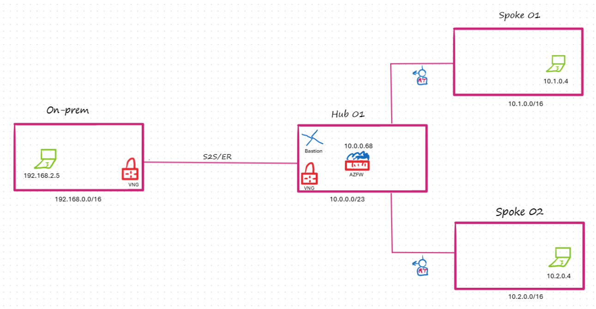

# Azure Hub-Spoke Network Infrastructure

Deploys a complete hub-and-spoke Azure network topology using Bicep. Includes a central hub with Azure Firewall, Azure Bastion, and Active/Active VPN gateways, two spoke VNets, and a simulated on-premises environment — all wired together with BGP-enabled Site-to-Site IPSec connections.

## Architecture



The topology connects four networks:

- **Spoke01 and Spoke02** peer into the Hub and route all traffic (including internet) through Azure Firewall
- **Hub** hosts all shared services — Firewall, Bastion, and the Active/Active VPN Gateway
- **OnPrem01** connects to the Hub via 4 Site-to-Site IPSec tunnels with BGP route exchange

### Network Details

| Network | Address Space | Purpose |
|---|---|---|
| Hub01 | 10.0.0.0/23 | Shared services (Firewall, Bastion, VPN GW) |
| Spoke01 | 10.0.2.0/24 | Workload spoke 1 |
| Spoke02 | 10.0.3.0/24 | Workload spoke 2 |
| OnPrem01 | 192.168.0.0/24 | Simulated on-premises environment |

### Hub Subnets

| Subnet | Prefix |
|---|---|
| default | 10.0.0.0/26 |
| GatewaySubnet | 10.0.0.64/26 |
| AzureFirewallSubnet | 10.0.0.128/26 |
| AzureBastionSubnet | 10.0.0.192/26 |

### Resources Deployed

| Resource | SKU / Config |
|---|---|
| Hub VPN Gateway | VpnGw1AZ, Active/Active, BGP ASN 65509 |
| OnPrem VPN Gateway | VpnGw1AZ, Active/Active, BGP ASN 65510 |
| VPN Connections | 4x IPSec with BGP (full active/active mesh) |
| Azure Firewall | Premium, allow-all rule (lab use) |
| Azure Bastion | Standard |
| VMs | 3x Ubuntu 22.04, Standard_B1s |

## Files

| File | Purpose |
|---|---|
| `main.bicep` | Complete infrastructure definition |
| `main.bicepparam` | Non-sensitive default parameters |
| `deploy.ps1` | PowerShell deployment script |

## Requirements

- [Azure CLI](https://learn.microsoft.com/en-us/cli/azure/install-azure-cli) installed and logged in (`az login`)
- [Bicep CLI](https://learn.microsoft.com/en-us/azure/azure-resource-manager/bicep/install) (`az bicep install`)
- Azure subscription with Contributor access

## Deployment

### Clone the repo

```powershell
git clone https://github.com/colinweiner111/azure-hub-and-spoke.git
cd azure-hub-and-spoke
```

### Deploy

Run `deploy.ps1` from PowerShell. The only required parameter is `-ResourceGroupName`.

```powershell
# Minimal — uses current subscription, centralus region
.\deploy.ps1 -ResourceGroupName rg-hub-spoke-centralus01

# Specify a different region
.\deploy.ps1 -ResourceGroupName rg-hub-spoke-eastus01 -Location eastus

# Specify a subscription
.\deploy.ps1 -ResourceGroupName rg-hub-spoke-centralus01 -SubscriptionId 00000000-0000-0000-0000-000000000000

# All options
.\deploy.ps1 `
    -ResourceGroupName  rg-hub-spoke-centralus01 `
    -SubscriptionId     00000000-0000-0000-0000-000000000000 `
    -Location           centralus `
    -AdminUsername      azureuser
```

The script will prompt for the VM admin password securely. You can also pass it via `-AdminPassword` (as a `SecureString`).

### Parameters

| Parameter | Required | Default | Description |
|---|---|---|---|
| `ResourceGroupName` | Yes | — | Resource group to deploy into (created if it doesn't exist) |
| `SubscriptionId` | No | Current CLI subscription | Azure subscription ID |
| `Location` | No | `centralus` | Azure region for all resources |
| `AdminUsername` | No | `azureuser` | VM administrator username |
| `AdminPassword` | No | Prompted | VM administrator password |

### Deployment time

Approximately **30–45 minutes**, dominated by the two VPN gateway deployments which run in parallel.

### Outputs

After deployment completes, the script prints:

| Output | Description |
|---|---|
| `firewallPrivateIp` | Azure Firewall private IP (used as next hop in route tables) |
| `bastionPublicIp` | Azure Bastion public IP |
| `hubGwPip1` / `hubGwPip2` | Hub VPN Gateway public IPs |
| `onpremGwPip1` / `onpremGwPip2` | OnPrem VPN Gateway public IPs |

## Connecting to VMs

All VMs are private-only (no public IPs). Connect via **Azure Bastion**:

1. Open the Azure portal
2. Navigate to any VM (`vm-spk01-01`, `vm-spk02-01`, `vm-onprem-01`)
3. Click **Connect → Bastion**
4. Enter username `azureuser` and the password you set at deploy time

## Traffic Flow

- **Spoke → Internet / Hub / OnPrem:** All traffic from spoke subnets routes through Azure Firewall (`0.0.0.0/0` UDR, BGP propagation disabled)
- **Hub ↔ OnPrem:** Active/Active IPSec VPN with BGP route exchange (4 connections for full redundancy)
- **Spoke ↔ Spoke:** Via Hub firewall (VNet peering with forwarded traffic enabled)

## Security Notes

> **This is a lab/demo deployment.**
> - The Azure Firewall is configured with an allow-all rule for testing
> - SSH (port 22) is open from any source on spoke/onprem NSGs
> - Replace these rules with least-privilege policies before using in production

## License

This project is open source and available under the [MIT License](LICENSE).
